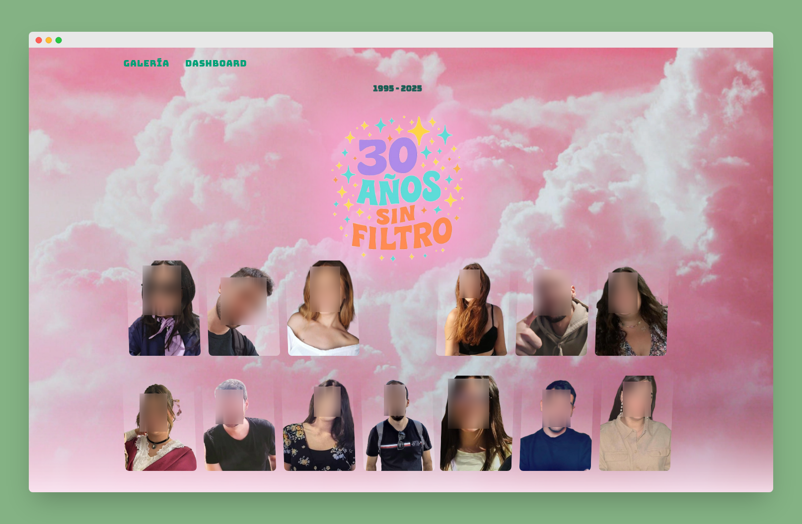

<div align="center">
<h2>
    Thirtys Album 📷
</h2>

</div>

<p>Aplicación SSR (Astro + Firebase) para subir imágenes a una galería compartida. Las imágenes se almacenan en Firebase Storage, y se registran en Firestore junto con metadatos como nombre, dimensiones y autor.</p>

<div align="center">


</div>

</img>

# Thirtys Album

Aplicación SSR (Astro + Firebase) para subir imágenes a una galería compartida. Las imágenes se almacenan en Firebase Storage, y se registran en Firestore junto con metadatos como nombre, dimensiones y autor.

## ✨ Características

- Subida de imágenes desde el dashboard.
- Validación de sesión con cookies (Firebase Auth via `firebase-admin`).
- Almacenamiento en Firebase Storage.
- Metadatos guardados en Firestore.
- Galería de imágenes pública en modo lectura.
- Componente Drag & Drop con React.
- Optimización de imágenes desde servidor con los endpoints de Astro.

## 🧱 Tecnologías

- [Astro](https://astro.build/)
- [Firebase Admin SDK](https://firebase.google.com/docs/admin/setup)
- [Firebase Auth](https://firebase.google.com/docs/auth)
- [Firebase Firestore](https://firebase.google.com/docs/firestore)
- [Firebase Storage](https://firebase.google.com/docs/storage)
- [Vercel](https://vercel.com/docs/frameworks/astro)

## 📦 Instalación

1. Clona el repositorio:

```bash
git clone https://github.com/vLorente/thirtys-album.git
cd thirtys-album
```

2. Instala las dependencias:

```bash
pnpm install
```

3. Configura las variables de entorno:

Crea un archivo .env con el siguiente contenido:

```env
FIREBASE_PRIVATE_KEY_ID=YOUR_PRIVATE_KEY_ID
FIREBASE_PRIVATE_KEY=YOUR_PRIVATE_KEY
FIREBASE_PROJECT_ID=YOUR_PROJECT_ID
FIREBASE_CLIENT_EMAIL=YOUR_CLIENT_EMAIL
FIREBASE_CLIENT_ID=YOUR_CLIENT_ID
FIREBASE_AUTH_URI=YOUR_AUTH_URI
FIREBASE_TOKEN_URI=YOUR_TOKEN_URI
FIREBASE_AUTH_CERT_URL=YOUR_AUTH_CERT_URL
FIREBASE_CLIENT_CERT_URL=YOUR_CLIENT_CERT_URL

PUBLIC_FIREBASE_API_KEY=PUBLIC_FIREBASE_API_KEY
PUBLIC_FIREBASE_AUTH_DOMAIN=PUBLIC_FIREBASE_AUTH_DOMAIN
PUBLIC_FIREBASE_PROJECT_ID=PUBLIC_FIREBASE_PROJECT_ID
PUBLIC_FIREBASE_STORAGE_BUCKET=PUBLIC_FIREBASE_STORAGE_BUCKET
PUBLIC_FIREBASE_MESSAGING_SENDER_ID=PUBLIC_FIREBASE_MESSAGING_SENDER_ID
PUBLIC_FIREBASE_APP_ID=PUBLIC_FIREBASE_APP_ID
PUBLIC_FIREBASE_MEASUREMENT_ID=PUBLIC_FIREBASE_MEASUREMENT_ID
```

> ⚠️ Asegúrate de que las claves sean válidas y que estén protegidas si subes el proyecto a un repositorio público.

4. Ejecuta el proyecto en desarrollo:

```bash
pnpm astro dev
```

## 🔐 Reglas de seguridad de Firebase

```javascript
// Firebase Storage
service firebase.storage {
  match /b/{bucket}/o {
    match /gallery/{allPaths=**} {
      allow read;
      allow write: if request.auth != null;
    }
  }
}

// Firestore (ejemplo)
rules_version = '2';
service cloud.firestore {
  match /databases/{database}/documents {
    match /images/{document=**} {
      allow read;
      allow write: if request.auth != null;
    }
  }
}

```

## 📸 Ejemplo de documento en Firestore

```json
{
  "id": "asdsa%2F2bfbb5c5-ed2e-457b-bcf1-467c43311ad5-asdasss-kxmk21.webp",
  "bucket": "your-bucket",
  "name": "abc123-image.jpg",
  "size": "23132",
  "url": "https://firebasestorage.googleapis.com/...",
  "thumbnailId": "asdsa%2F2bfbb5c5-ed2e-457b-bcf1-467c43311ad5-asdasss-kxmk21.webp",
  "thumbnailUrl": "https://firebasestorage.googleapis.com/...",
  "width": 1920,
  "height": 1080,
  "timeCreated": "2025-07-14T12:34:56Z"
}
```
